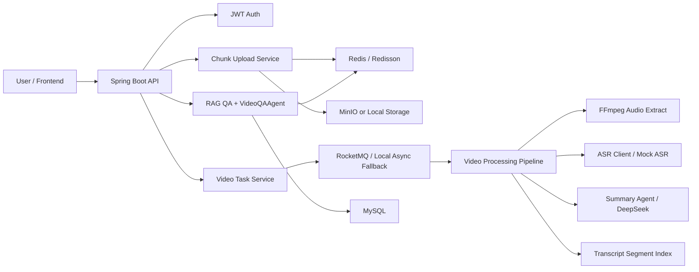

# VideoAI

AI 视频解析与智能问答平台，面向长视频内容理解场景，覆盖用户鉴权、分片上传、异步处理、音频提取、语音转写、AI 总结、RAG 检索问答、Agent 工具调用、高并发防重与成本治理。

## 项目简介

`VideoAI` 不是普通的视频上传网站，而是一个“视频内容理解 + Agent 智能体 + 工程治理”一体化项目。它适合校招、实习、毕设和简历展示，原因在于：

- 业务闭环完整：上传 -> 存储 -> 解析 -> 转写 -> 总结 -> 问答 -> 统计
- 工程亮点鲜明：RocketMQ、Redisson WatchDog、秒传、断点续传、限流、重试、缓存、状态机
- AI 亮点明确：LangChain4j、DeepSeek、VideoQAAgent、TaskAssistantAgent、RAG 片段召回
- 本地可跑：默认内置 Mock ASR / Mock DeepSeek，可在没有外部 Key 时完整演示主流程

## 技术栈

### 后端

- Java 17
- Spring Boot 3.3.x
- Spring MVC / Validation / AOP / Async
- MyBatis-Plus
- MySQL 8
- Redis / Redisson
- RocketMQ
- MinIO
- FFmpeg
- LangChain4j
- DeepSeek API
- JWT
- Knife4j

### 前端

- Vue 3
- Vite
- TypeScript
- Pinia
- Vue Router
- Axios
- Element Plus

## 系统架构图说明



说明：

- 上传链路使用分片上传、Redis 记录分片进度、MD5 秒传和内容级去重
- 任务链路通过 RocketMQ 异步化，默认可切换为本地异步执行，便于快速演示
- 解析链路包含 FFmpeg 提取音频、ASR 转写、结构化总结、分段索引
- 问答链路区分普通 RAG 问答和 Agent 工具调用问答

## 核心业务流程

1. 用户登录后发起大文件上传，前端切片并计算文件 MD5
2. 后端初始化上传记录，判断是否命中秒传
3. 前端按分片上传，Redis 维护分片进度，支持断点续传
4. 合并成功后写入 `media_file`，再创建 `video_task`
5. 任务通过 RocketMQ 或本地异步进入处理链路
6. 处理服务使用 Redisson + WatchDog 对 `taskId/fileMd5` 加锁防重
7. FFmpeg 提取音频，ASR 生成完整转写和分段结果
8. SummaryAgent 生成 `title/summary/outline/keywords/highlights/qa_suggestions`
9. 将转写文本拆段入库，构建简化版 RAG 检索索引
10. 用户在任务详情中发起普通 QA 或 Agent QA，多轮上下文保存在 Redis

## AI Agent 设计说明

### 1. VideoQAAgent

职责：

- 围绕具体视频任务回答用户问题
- 可按需调用以下工具：
  - 查询视频基础信息
  - 查询任务状态
  - 查询任务事件日志
  - 查询完整转写文本
  - 查询结构化摘要
  - 检索相关视频片段
  - 按关键词定位片段

落地位置：

- [VideoQAAgent.java](/E:/Video/VideoAI/videoai-backend/src/main/java/com/videoai/agent/VideoQAAgent.java)
- [VideoAgentTools.java](/E:/Video/VideoAI/videoai-backend/src/main/java/com/videoai/agent/VideoAgentTools.java)
- [LangChainAgentRunner.java](/E:/Video/VideoAI/videoai-backend/src/main/java/com/videoai/agent/LangChainAgentRunner.java)

### 2. SummaryAgent

当前实现形态：

- 默认走 `MockDeepSeekClient`，保证无外部依赖即可演示
- 配置真实 `DeepSeek API Key` 后自动切换为真实调用
- 输出结构化摘要并记录 token 与耗时

### 3. TaskAssistantAgent

职责：

- 解释“处理到哪一步”“为什么失败了”
- 优先依赖任务状态与事件日志工具

## RAG 设计说明

VideoAI 没把整段转写直接塞给模型，而是采用“切片 + 检索增强”：

- `video_transcript` 保存完整转写
- `video_transcript_segment` 保存分段文本、时间戳、关键词
- 用户提问时先召回相关片段，再交给大模型生成答案
- 当前实现是 MySQL/内存关键词召回版 RAG，同时预留向量检索升级空间

收益：

- 降低上下文长度
- 提升回答相关性
- 降低 token 成本

## 成本治理与高并发治理说明

### 已实现的工程亮点

- RocketMQ 将视频处理链路异步化，同步接口快速返回
- Redisson + WatchDog 解决长耗时任务锁续期问题
- MD5 内容级去重与秒传
- Redis 记录上传进度，支持断点续传
- Redis 令牌桶限流控制上传与问答频率
- 第三方调用统一指数退避重试
- 摘要缓存、QA 缓存、重复任务拦截
- `ai_usage_record` 统计 token、模型、耗时、缓存命中和用户维度调用量
- 清晰状态机 + `task_event_log` 实现可观测性

### 新增的强亮点

- `VideoQAAgent`：基于 Tool Calling 的视频理解智能体
- 简化版 RAG：长视频内容精准片段召回
- AI 成本治理：缓存、限流、重复任务拦截、额度统计
- 任务状态机 + 事件日志：处理过程可追踪、可定位、可前端展示

## 项目结构

```text
VideoAI/
├─ videoai-backend
├─ videoai-frontend
├─ sql
│  └─ videoai.sql
├─ docs
│  ├─ ARCHITECTURE.md
│  └─ API.md
└─ docker-compose.yml
```

## 启动步骤

### 1. 初始化数据库

执行：

```sql
SOURCE sql/videoai.sql;
```

默认演示账号：

- 用户名：`demo_user`
- 密码：`123456`

### 2. 启动依赖

至少需要：

- MySQL 8
- Redis

可选：

- MinIO
- RocketMQ
- FFmpeg
- DeepSeek API Key

也可以直接使用根目录的 `docker-compose.yml` 启动基础依赖。

### 3. 启动后端

```bash
cd videoai-backend
mvn spring-boot:run
```

默认端口：`8080`

说明：

- `videoai.ai.mock=true` 时，默认使用 Mock ASR / Mock AI，可直接跑通主链路
- 如需真实大模型，修改 [application-dev.yml](/E:/Video/VideoAI/videoai-backend/src/main/resources/application-dev.yml)

### 4. 启动前端

```bash
cd videoai-frontend
npm install
npm run dev
```

默认端口：`5173`

## 接口说明

详细接口见：

- [API.md](/E:/Video/VideoAI/docs/API.md)

重点接口包括：

- `POST /api/user/register`
- `POST /api/user/login`
- `POST /api/upload/init`
- `POST /api/upload/chunk`
- `POST /api/upload/merge`
- `POST /api/video-task/create`
- `GET /api/video-task/page`
- `GET /api/video-result/{taskId}/summary`
- `POST /api/chat/ask`
- `POST /api/agent/video/ask`
- `GET /api/usage/me`

## 本地运行说明

### Mock 模式

适合快速演示：

- 不依赖外部 ASR 服务
- 不依赖真实 DeepSeek Key
- 不强依赖 RocketMQ 和 MinIO

### 真实模式

将以下配置切换为真实值：

- `videoai.ai.mock=false`
- `videoai.ai.api-key=你的 DeepSeek Key`
- `videoai.minio.enabled=true`
- `videoai.mq.enabled=true`

## Docker 部署说明

根目录提供：

- [docker-compose.yml](/E:/Video/VideoAI/docker-compose.yml)
- [videoai-backend/Dockerfile](/E:/Video/VideoAI/videoai-backend/Dockerfile)
- [videoai-frontend/Dockerfile](/E:/Video/VideoAI/videoai-frontend/Dockerfile)

可以先启动基础依赖，再单独本地运行后端和前端；也可继续扩展为完整容器化部署。

## 简历可写亮点总结

- 设计并实现 VideoAI 平台，完成大文件分片上传、断点续传、MD5 秒传、异步视频解析、AI 总结与视频问答全链路
- 使用 RocketMQ 将 60s+ 的视频处理链路异步化，并结合 Redisson WatchDog 解决长耗时任务的分布式锁续期问题
- 基于 LangChain4j + DeepSeek 设计 VideoQAAgent，通过 Tool Calling 自动查询任务状态、摘要、转写和片段，提升问答精度
- 构建简化版 RAG，将长视频转写切片入库并进行关键词召回，降低上下文长度与 token 消耗
- 搭建 AI 成本治理体系，落地 Redis 限流、摘要缓存、FAQ 缓存、重复任务拦截、token usage 与用户配额统计
- 设计任务状态机与事件日志表，实现任务处理过程可观测、可回放、可定位失败节点

## 后续可扩展方向

- 接入 Whisper / 火山 / 阿里云等真实 ASR 服务
- 引入向量数据库替换简化 RAG
- 增加多模型路由与质量评估
- 接入对象存储回调和死信队列处理
- 增加后台管理端与运维告警

